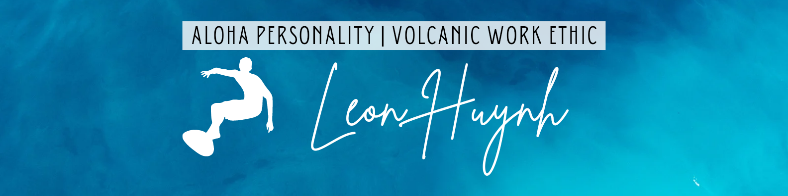

<body bgcolor="#cbeeed">

  							Aloha, I'm Leon.

  I enjoy anything that is logic base! Since I was six, i started playing Chinese Chess and played some city wide tournaments as I got older.  I am a huge poker enthusiast because of the logic and the psychology aspect of the game.  Naturally using logic to find solutions is what I'm good at so a career as a Software Engineer only made LOGICAL sense.   

I'm currently working on a hiking application that allows users to search hiking spots near them and allows the user to create a hiking list to accomplished.

The best way to reach me is by email!

<!-- SOCIALS -->
<h3 align="center">Contact Me</h3>

  
  
  
  
  <!--  -->

<!-- LANGUAGES/TOOLS -->
<h3 align="center">Code Stats</h3>

  

<h3 align="center">Technical Skills</h3>
  

	
	
	
	
	
	
	
	
	
  

<!-- PROJECTS -->
<h3 align="center">Highlighted Projects</h3>

  <table>
      <tr>
        <td width="30%">
          <h3 align="center">Jobiz.Tattoo</h3>
          

            
              
            

              <strong>What I used: JavaScript, HTML5, CSS3,  - </strong>Jobiz.Tattoo is a simple responsive site that display the artist's beautiful work.
            

          

        </td>
        <td width="30%">
          <h3 align="center">De Lotus Salon</h3>
          

            
              </a> 
            

              <strong>What I used: JavaScript, HTML5, CSS3,  - </strong>De Lotus Salon invites customers with the warm aloha touch.
            

          

        </td>
      </tr>
  </table>
  <table>
      <tr>
        <td width="30%">
          <h3 align="center">Stranger Thing Character Info</h3>
          

            
              </a> 
            

              <strong>What I used: JavaScript, HTML5, CSS3  - </strong>Stranger Thing Character Search using Stranger Thing API
            

          

        </td>
        <td width="30%">
          <h3 align="center">Built to Last</h3>
          

            
              </a> 
            

              <strong>What I used: JavaScript, HTML5, CSS3, PHP - </strong>Built to Last web application was focus on captivating the user with videos and interactive landing page.
            

          

        </td>
      </tr>
  </table>

</body>
